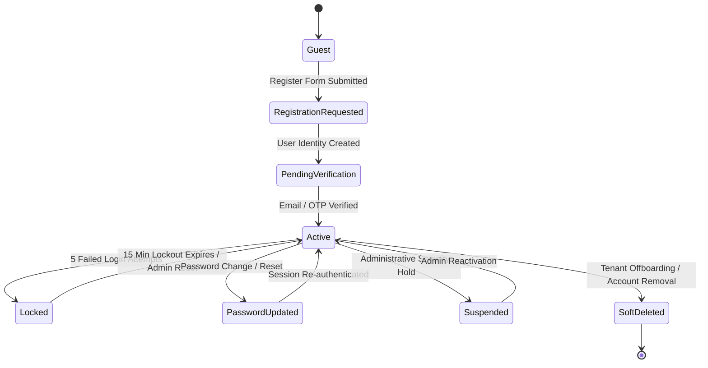

# Enterprise Identity Account Lifecycle Specification

**System Name:** FinTrack Pro  
**Document Type:** IAM Account State Machine Specification  
**Classification:** Enterprise Internal Security Standard  
**Version:** 3.0.0  

---

## 1. Executive Summary

This specification defines the complete state machine governing user account identities in **FinTrack Pro**. Account state transitions are enforced strictly by `AuthService` and validated prior to executing any state mutation.

---

## 2. Identity State Machine Topology

---

## 3. Account State Matrix & Transition Rules

| State | Authentication Allowed? | API Access Level | Allowed State Transitions |
| :--- | :---: | :--- | :--- |
| **Guest** | No | Unauthenticated Endpoints | `RegistrationRequested` |
| **PendingVerification** | Restricted | Verification Endpoints Only | `Active`, `SoftDeleted` |
| **Active** | Yes | Full Role & Permission Access | `Locked`, `PasswordUpdated`, `Suspended`, `SoftDeleted` |
| **Locked** | Banned (423) | None | `Active` (after 15m expiration) |
| **Suspended** | Banned (403) | None | `Active` (via Super Admin override) |
| **SoftDeleted** | Banned (401) | None | None (Immutable terminal state) |
