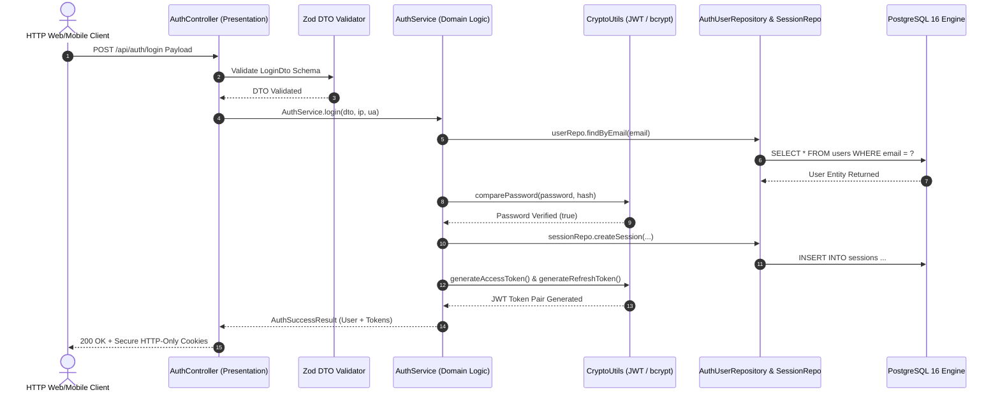

# Enterprise Authentication & Identity Platform Architecture

**System Name:** FinTrack Pro  
**Document Type:** Security & IAM Platform Architecture Specification  
**Classification:** Enterprise Internal Security Standard  
**Version:** 3.0.0  

---

## 1. Architectural Blueprint & Layered Topology

The **FinTrack Pro** authentication engine implements a zero-trust, decoupled, feature-based modular backend architecture. Presentation, orchestration, business logic, domain persistence, and audit logging layers are strictly separated:



---

## 2. JWT Access Token & Refresh Token Rotation Protocol

### Access Token Specification
- **Token Format:** Signed JSON Web Token (JWT) with HS256 HMAC-SHA256 signature.
- **Lifespan:** 15 Minutes ($900\text{ seconds}$).
- **Cookie Security:** `fintrack_access_token`, `HttpOnly`, `SameSite=Strict`, `Secure=true` in production, `Path=/`.
- **Payload Claims:**
  ```json
  {
    "sub": "9b1deb4d-3b7d-4bad-9bdd-2b0d7b3dcb6d",
    "email": "admin@fintrackpro.internal",
    "role": "SUPER_ADMIN",
    "organizationId": "a1b2c3d4-e5f6-7890-abcd-ef1234567890",
    "sessionId": "c0a80101-0000-0000-0000-000000000001",
    "iat": 1784889000,
    "exp": 1784889900
  }
  ```

### Refresh Token & Family Rotation
- **Token Format:** Cryptographic opaque token stored in PostgreSQL `Session` model.
- **Lifespan:** 7 Days ($604,800\text{ seconds}$).
- **Rotation Pattern:** Every token refresh invocation (`POST /api/auth/refresh`) invalidates the consumed refresh token and issues a new opaque refresh token string. Attempting to reuse an expired or revoked refresh token triggers immediate session termination for security.

---

## 3. Account Lockout & Brute-Force Countermeasures

1. **Failure Threshold:** 5 consecutive failed password attempts (`AUTH_CONSTANTS.MAX_FAILED_LOGIN_ATTEMPTS`).
2. **Lockout Duration:** 15 minutes (`AUTH_CONSTANTS.LOCKOUT_DURATION_MINUTES`).
3. **Audit Log Registration:** Every failed login registers an immutable audit event (`LOGIN_FAILED`) in `audit_logs` tracking IP address and User-Agent.
