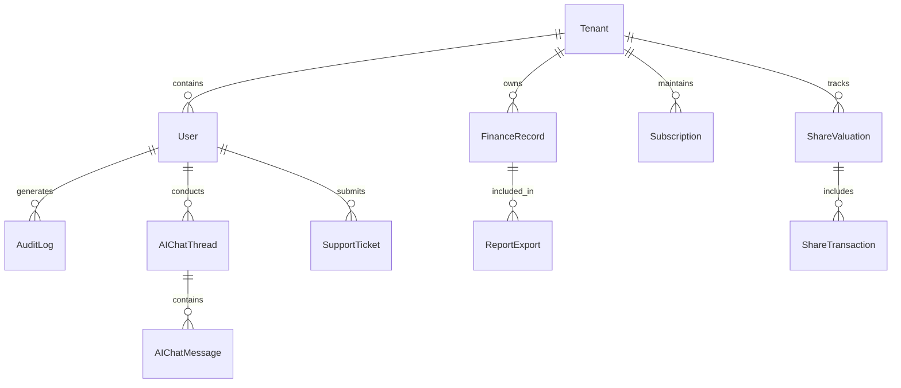

# Database Design — FinTrack Pro Enterprise AI Finance Management Platform

## 1. Executive Summary
This document provides the complete technical specification for the PostgreSQL database architecture underlying FinTrack Pro. It details table definitions, relational cardinality, index design, foreign key constraints, partition strategies, and data integrity guarantees.

---

## 2. Entity Relationship Diagram (ERD Overview)

---

## 3. Core Database Table Definitions

### 3.1 `tenants`
- `id` (UUID, Primary Key): Unique tenant identifier.
- `name` (VarChar 255, NOT NULL): Company / Tenant organization name.
- `slug` (VarChar 100, UNIQUE, NOT NULL): URL-safe tenant identifier.
- `tier` (VarChar 50, DEFAULT 'STARTER'): Subscription tier (`STARTER`, `PRO`, `ENTERPRISE`).
- `status` (VarChar 50, DEFAULT 'ACTIVE'): Status (`ACTIVE`, `SUSPENDED`, `CANCELLED`).
- `createdAt` (Timestamp, DEFAULT NOW()).
- `updatedAt` (Timestamp, DEFAULT NOW()).

### 3.2 `users`
- `id` (UUID, Primary Key): Unique user identifier.
- `tenantId` (UUID, Foreign Key -> `tenants.id` ON DELETE CASCADE): Parent tenant ID.
- `email` (VarChar 255, UNIQUE, NOT NULL): User primary email.
- `passwordHash` (VarChar 255, NOT NULL): Bcrypt hashed password (12 cost factor).
- `name` (VarChar 255, NOT NULL): Full user name.
- `role` (VarChar 50, DEFAULT 'USER'): Role (`SUPER_ADMIN`, `ADMIN`, `FINANCE_MANAGER`, `USER`, `AUDITOR`).
- `mfaEnabled` (Boolean, DEFAULT false).
- `mfaSecret` (VarChar 255, NULLABLE).
- `createdAt`, `updatedAt`.

### 3.3 `finance_records`
- `id` (UUID, Primary Key).
- `tenantId` (UUID, Foreign Key -> `tenants.id` ON DELETE CASCADE).
- `userId` (UUID, Foreign Key -> `users.id` ON DELETE SET NULL).
- `amount` (Decimal 18, 4, NOT NULL): Transaction monetary value.
- `type` (VarChar 50, NOT NULL): Type (`INCOME`, `EXPENSE`, `ASSET`, `LIABILITY`).
- `category` (VarChar 100, NOT NULL): Expense / Revenue category.
- `description` (Text, NULLABLE).
- `transactionDate` (Timestamp, NOT NULL).
- `status` (VarChar 50, DEFAULT 'COMPLETED'): Status (`PENDING`, `COMPLETED`, `RECONCILED`).
- `createdAt`, `updatedAt`.

### 3.4 `audit_logs`
- `id` (UUID, Primary Key).
- `tenantId` (UUID, NOT NULL).
- `userId` (UUID, NULLABLE).
- `action` (VarChar 100, NOT NULL): e.g. `USER_LOGIN`, `RECORD_CREATED`, `SUBSCRIPTION_UPGRADED`.
- `resource` (VarChar 100, NOT NULL): Target entity name.
- `details` (JSONB, NOT NULL): Context payload & state diff.
- `ipAddress` (VarChar 45, NOT NULL).
- `createdAt` (Timestamp, DEFAULT NOW()).

---

## 4. Indexing Strategy & Performance Tuning

1. **Multi-Tenant Composite Indexes**:
   - `CREATE INDEX idx_finance_records_tenant_date ON finance_records(tenantId, transactionDate DESC);`
   - `CREATE INDEX idx_audit_logs_tenant_created ON audit_logs(tenantId, createdAt DESC);`
2. **Lookup Indexes**:
   - `CREATE UNIQUE INDEX idx_users_email ON users(email);`
   - `CREATE INDEX idx_users_tenant_role ON users(tenantId, role);`
3. **JSONB Indexing**:
   - `CREATE INDEX idx_audit_logs_details_gin ON audit_logs USING GIN (details jsonb_path_ops);`

---

## 5. Partitioning & Connection Pooling

- **Partition Strategy**: Range partitioning on `audit_logs` and `finance_records` tables by month (`transactionDate` / `createdAt`).
- **Connection Pool Configuration (Prisma / PgBouncer)**:
  - Max Pool Size: 20 connections per server instance.
  - Idle Timeout: 30,000 ms.
  - Connection Lifetime: 1,800,000 ms.

---
