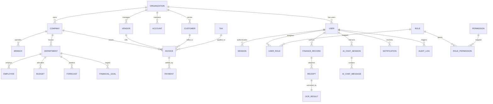

# Enterprise Database Entity-Relationship Diagram (ERD) Specification

**System Name:** FinTrack Pro (Enterprise AI Finance Management System)  
**Document Type:** Visual ERD & Topological Domain Boundaries  
**Classification:** Enterprise Internal Architecture Standard  
**Version:** 2.0.0  

---

## 1. Executive Summary

This document presents the visual topology and entity-relationship diagrams for **FinTrack Pro**. The schema models 32 enterprise domain entities organized across 8 logical domain boundaries:

1. **Multi-Tenant Hierarchy:** Organization, Company, Branch, Department, Employee
2. **Identity & Security:** User, Session, Role, Permission, UserRole, RolePermission
3. **Banking & Treasury:** Account, BankAccount, Vendor, Customer, Tax
4. **Transactions & Ledger:** FinanceRecord, Category, Invoice, Payment
5. **Planning & Analytics:** Budget, Forecast, FinancialGoal, Investment, Loan, ShareValue
6. **Document Ingestion:** Receipt, OcrResult, Attachment
7. **Conversational AI:** AiChatSession, AiChatMessage, AiChatLog
8. **System & Governance:** Report, Notification, DashboardWidget, AuditLog, ActivityLog, SystemSetting

---

## 2. Master Domain Mermaid ERD Diagram



---

## 3. Logical Domain Boundary Maps

### 1. Multi-Tenant Organization Boundary
- Root Tenant: `Organization`
- Children: `Company`, `Branch`, `Department`, `Employee`, `User`
- Isolation Rule: Every tenant query filters strictly by `organization_id` or `company_id`.

### 2. General Ledger & Invoice Settlement Boundary
- Invoicing: `Invoice` $\rightarrow$ `Payment` $\rightarrow$ `Account`
- Ledger: `FinanceRecord` $\rightarrow$ `Category`
- Audit Integrity: Financial entries require `created_by_id` with `onDelete: Restrict`.

---

## 4. Architectural Evaluation Matrix

```text
┌───────────────────────────┬────────────────────────────────────────────────────────┐
│ Dimension                 │ Architectural Impact & System Benefit                  │
├───────────────────────────┼────────────────────────────────────────────────────────┤
│ Technical Reasoning       │ Visual domain boundary isolation prevents circular     │
│                           │ entity references and clarifies module ownership       │
├───────────────────────────┼────────────────────────────────────────────────────────┤
│ Security Implications     │ Organization-level boundary trees guarantee zero       │
│                           │ cross-tenant data leakage in multi-tenant SaaS models  │
├───────────────────────────┼────────────────────────────────────────────────────────┤
│ Scalability Considerations│ Clear entity cluster boundaries enable microservice    │
│                           │ decoupling (e.g., Ledger Service vs AI Service)        │
└───────────────────────────┴────────────────────────────────────────────────────────┘
```
