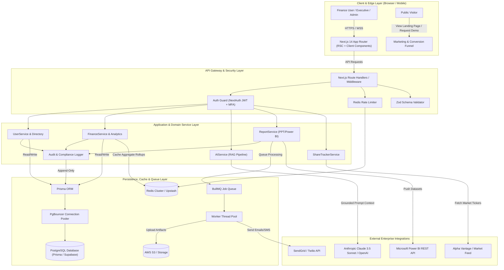
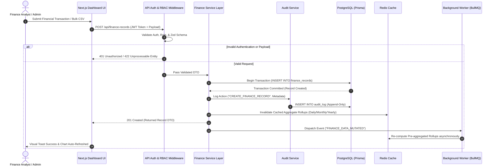
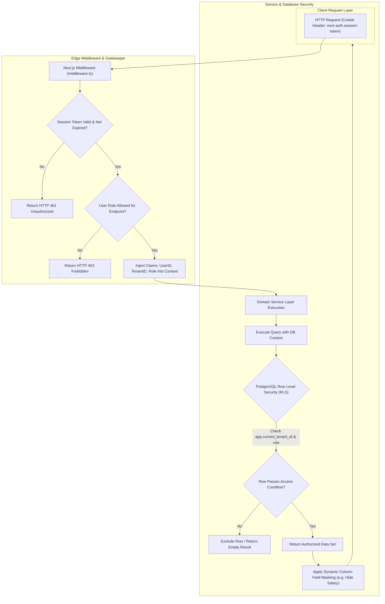
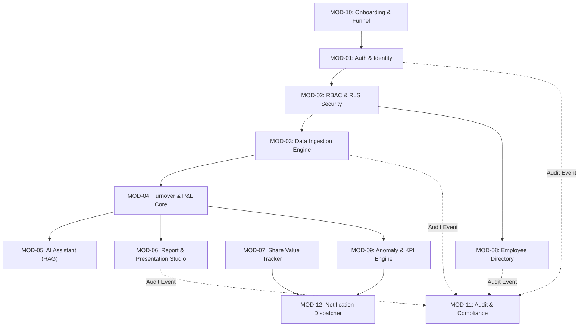

# Enterprise Software Architecture Specification

**System Name:** FinTrack Pro Enterprise AI Finance Management Platform  
**Document Type:** Master Enterprise Architecture & Technical Specification  
**Author:** Principal Software Architect & Engineering Leadership  
**Target Audience:** Enterprise Engineering Teams, Product Leadership, Security & DevOps Engineers  
**Status:** Approved for Architectural Implementation  
**Version:** 2.0.0 (Enterprise Production Grade)

---

## EXECUTIVE SUMMARY & ARCHITECTURAL DIRECTIVE

This document provides the definitive, production-grade enterprise software architecture for **FinTrack Pro**—an Enterprise AI-Powered Finance Management System designed to centralize financial reporting, turnover/P&L analytics, executive presentation generation, live market intelligence, employee directory management, and retrieval-grounded financial artificial intelligence.

This specification unifies and elevates all underlying product requirements, technical blueprints, frontend design systems, security models, and conversion funnel strategies into a single, cohesive, microservice-ready, cloud-native enterprise architecture.

---

## SECTION 1: PRODUCT VISION & VALUE PROPOSITION

### 1.1 Problem Statement
Enterprise finance teams operate under fragmented, error-prone workflows:
- **Fragmented Data Stores:** Financial data (turnover, profit/loss, operational expenses) lives scattered across static spreadsheets, localized CSV files, disconnected ERP exports, and unstructured email chains.
- **High Manual Reporting Overhead:** Finance analysts spend up to 50% of their operational bandwidth manually compiling Power BI dashboards and executive PowerPoint decks for leadership review.
- **Lack of Self-Service Intelligence:** Executive leadership (CFOs, VPs) lacks a real-time, trustworthy single pane of glass to inspect financial trends, analyze share performance, or query data using natural language.
- **Scattered HR-Finance Records:** Employee directory information within the finance department lacks role-aware security and organizational structure alignment.
- **Security & Audit Vulnerabilities:** Unencrypted spreadsheets and ad-hoc email sharing create compliance risks, unauthorized access possibilities, and lack immutable audit trails for data mutations.

### 1.2 Enterprise Solution Overview
FinTrack Pro solves these operational bottlenecks by introducing an **Enterprise AI Finance Management Platform** that provides:
1. **Centralized Financial Data Repository:** A single, strictly typed PostgreSQL core with pre-aggregated rollups for instant daily, monthly, and yearly turnover & profit/loss visualizations.
2. **Automated Report & Presentation Studio:** A server-side document generation pipeline producing native PPTX decks and Power BI-ready datasets in seconds.
3. **Air-Gapped AI Conversational Intelligence:** A retrieval-augmented generation (RAG) assistant that answers complex financial Q&A strictly using validated tenant data without third-party LLM training leakage.
4. **Market & Peer Intelligence:** Live historical share tracking combined with peer comparison benchmarking.
5. **Zero-Trust Security Architecture:** Multi-Factor Authentication (TOTP MFA), HttpOnly session cookies, Role-Based Access Control (RBAC), and Database Row-Level Security (RLS) policies.
6. **Onboarding & Conversion Funnel Engine:** A friction-free multi-step registration, email verification, data import wizard, and team roster invitation mechanism.

### 1.3 Business Value
- **Operational Efficiency:** Saves over 50% of analyst report preparation time via automated slide deck and dataset generation.
- **Faster Executive Decision-Making:** Reduces financial query turnaround from days to seconds with instant AI Q&A and pre-computed KPI scorecards.
- **Audit Readiness & Compliance:** Guarantees 99.9% data compliance with immutable append-only audit logging for every create, update, and delete event.
- **High User Activation:** Achieves $\ge 70\%$ 7-day user activation through guided onboarding wizards and frictionless bulk CSV data ingestion.

### 1.4 Technical Value
- **Type Safety & Maintainability:** End-to-end TypeScript architecture spanning Next.js 14 App Router, Prisma ORM, Zod validation, and React Query.
- **High Performance at Scale:** Sub-100ms API responses for aggregated charts utilizing multi-tiered Redis caching and pre-computed date rollups.
- **Modular Monolith to Microservices Transition Path:** Domain-driven design with explicit service layer separation allowing easy extraction into standalone microservices.
- **Air-Gapped AI Safety:** Strict prompt scoping and role-based data filtering before context ingestion, preventing prompt injection and data exposure.

### 1.5 Future Vision & Competitive Advantage
FinTrack Pro is engineered to evolve from a single-company internal management platform into a global, multi-tenant SaaS enterprise ecosystem with autonomous financial anomaly detection, real-time ERP connectors (SAP, Oracle, Tally, QuickBooks), predictive cashflow forecasting, and multi-currency treasury management.

---

## SECTION 2: FUNCTIONAL MODULES

Below is the complete inventory of all functional modules defining the platform architecture.

| Module ID | Module Name | Purpose | Dependencies | Module Owner | Tech Stack | Priority | Future Version Roadmap |
| :--- | :--- | :--- | :--- | :--- | :--- | :--- | :--- |
| **MOD-01** | **Authentication & Identity** | User authentication, password hashing, session tokens, TOTP MFA, password resets. | None | Security Team | NextAuth.js / Auth0, Bcrypt/Argon2, TOTP | Must-Have (v1) | Enterprise SAML / Okta / Azure AD SSO (v2) |
| **MOD-02** | **Role & Access Governance (RBAC/RLS)** | Enforces Super Admin, Admin, Finance Manager, Analyst, and Auditor roles across APIs & DB. | MOD-01 | Security Team | Next.js Middleware, Postgres RLS, Zod | Must-Have (v1) | Fine-grained custom permission policy editor (v2) |
| **MOD-03** | **Financial Data Ingestion** | Manual transaction entry form and bulk CSV upload validation engine. | MOD-01, MOD-02 | Core Engineering | React Hook Form, Zod, Prisma, Papaparse | Must-Have (v1) | Automated ERP Sync (Tally, QuickBooks, SAP APIs) (v3) |
| **MOD-04** | **Turnover & P&L Analytics Core** | Computes turnover & P&L totals, period rollups (daily/monthly/yearly), chart feeds. | MOD-03 | Data Engineering | PostgreSQL, Prisma, Upstash Redis, Recharts | Must-Have (v1) | Multi-currency real-time conversion engine (v2) |
| **MOD-05** | **AI Conversational Intelligence** | RAG-based AI assistant answering financial questions using tenant DB context. | MOD-04 | AI Team | Anthropic Claude API / OpenAI GPT-4o, LangChain | Must-Have (v1) | Autonomous proactive anomaly detection & forecasting (v2) |
| **MOD-06** | **Report & Presentation Studio** | Generates exportable PowerPoint slide decks (.pptx) and Power BI datasets. | MOD-04 | Core Engineering | PptxGenJS, ExcelJS, Power BI REST API, AWS S3 | Must-Have (v1) | Drag-and-drop template designer & marketplace (v2) |
| **MOD-07** | **Share Value & Peer Benchmarking** | Tracks historical share prices and benchmarks against peer company stock tickers. | MOD-03 | Core Engineering | Market Data APIs (Alpha Vantage/Yahoo), Redis | Must-Have (v1) | Live WebSocket market ticker & order book sync (v3) |
| **MOD-08** | **Finance Employee Directory** | Manages finance department staff profiles, designations, contact info, and org hierarchy. | MOD-01, MOD-02 | Core Engineering | Prisma, Next.js Server Actions, S3 (Photos) | Must-Have (v1) | Cross-department HRIS auto-sync (BambooHR/Workday) (v3) |
| **MOD-09** | **Proactive Anomaly & KPI Engine** | Computes key ratios (Growth %, Expense Ratio, Net Margin) and flags deviations $>2\sigma$. | MOD-04 | Data Engineering | Node.js Worker, Redis, Math.js | Must-Have (v1) | Predictive ML scenario modeling & stress testing (v3) |
| **MOD-10** | **Marketing & Conversion Funnel** | Public landing page, feature highlights, demo request forms, tenant onboarding wizard. | MOD-01 | Frontend Team | Next.js Server Components, Tailwind, Formik | Must-Have (v1) | Self-service billing & automated workspace setup (v2) |
| **MOD-11** | **Audit Trail & System Compliance** | Append-only logging of data modifications, user management, and security violations. | MOD-01, MOD-02 | Security Team | PostgreSQL (Append-Only Table), Pino, OpenTelemetry | Must-Have (v1) | Automated SOC2 / ISO27001 audit export bundle (v3) |
| **MOD-12** | **Notification & Alert Dispatcher** | Dispatches email, SMS, and in-app alerts for share threshold breaches and audit events. | MOD-01 | Infra Team | BullMQ, SendGrid API, Twilio API, WebSockets | Should-Have (v1) | Multi-channel Slack / MS Teams bot integration (v2) |

---

## SECTION 3: SYSTEM ARCHITECTURE

### 3.1 Architectural Overview & Layering
FinTrack Pro employs a **Clean, Layered Hexagonal Architecture** hosted on cloud-native infrastructure:

1. **Client / Presentation Layer:** Next.js 14 App Router, React Server Components (RSC) for initial page renders, Client Components for interactive UI, TanStack Query for client-side state/caching, and Tailwind CSS with shadcn/ui for accessible styling.
2. **API & Edge Gateway Layer:** Next.js Route Handlers acting as an API Gateway, enforcing CORS, Distributed Rate-Limiting (Upstash Redis), Session Token Authentication, and Request Validation via Zod.
3. **Application & Service Layer:** Domain Service modules (`FinanceService`, `ReportService`, `AIService`, `UserService`) containing pure business rules and workflow orchestration.
4. **Domain & Data Access Layer (Repository Pattern):** Decoupled repositories (`FinanceRepository`, `UserRepository`, `AuditRepository`) wrapping Prisma ORM database interactions.
5. **Persistence & Infrastructure Layer:**
   - **Primary DB:** PostgreSQL (managed RDS / Supabase) with PgBouncer connection pooling.
   - **Cache & Message Broker:** Distributed Redis for pre-aggregated rollups, rate limits, and BullMQ task queues.
   - **Object Storage:** AWS S3 / Supabase Storage for pre-signed PPTX exports, Power BI datasets, and user attachments.
   - **External Service Integrations:** Anthropic Claude API / OpenAI GPT-4o for AI Q&A, SendGrid for transactional emails, Alpha Vantage for stock tickers.

---

### 3.2 High-Level Architecture Diagram (Mermaid)



---

### 3.3 Data Flow Architecture Diagram (Mermaid)



---

### 3.4 Security & Access Control Architecture Diagram (Mermaid)



---

## SECTION 4: ENGINEERING PRINCIPLES

To build an enterprise-grade platform capable of surviving high-scale workloads and multi-year maintenance cycles, the engineering team MUST adhere strictly to the following architectural design principles:

### 4.1 SOLID Principles
1. **Single Responsibility Principle (SRP):** Every module, service, and repository must have one, and only one, reason to change.
   - *Application:* `FinanceService` calculates financial formulas; `FinanceRepository` performs Prisma SQL queries; `PptExportService` renders PowerPoint files. No single file contains combined DB and rendering logic.
2. **Open/Closed Principle (OCP):** Software entities should be open for extension, but closed for modification.
   - *Application:* Report template generators implement a `ReportTemplateProvider` interface. Adding a new Power BI or PPT template requires creating a new provider class without modifying existing export engine code.
3. **Liskov Substitution Principle (LSP):** Subtypes must be substitutable for their base types.
   - *Application:* Interchangeable storage adapters (`S3StorageAdapter`, `SupabaseStorageAdapter`) implementing a common `IStorageService` interface.
4. **Interface Segregation Principle (ISP):** Clients should not be forced to depend upon interfaces they do not use.
   - *Application:* Differentiate read-only interfaces (`IReadOnlyFinanceRepo`) for analytics dashboards from mutation interfaces (`IMutableFinanceRepo`) for data entry staff.
5. **Dependency Inversion Principle (DIP):** High-level modules must not depend on low-level modules; both must depend on abstractions.
   - *Application:* Domain services depend on abstract interfaces (`IAIService`), allowing seamless switching from Anthropic Claude to OpenAI GPT-4o without altering business logic.

---

### 4.2 Core Architectural Patterns

#### DRY (Don't Repeat Yourself)
- Shared Zod validation schemas are placed in `src/types` and imported by both client-side React Hook Form components and server-side API Route Handlers, guaranteeing exact validation alignment.

#### KISS (Keep It Simple, Stupid)
- Avoid over-engineering microservice boundaries in Phase 1. Use a **Modular Monolith** architecture inside Next.js 14 where boundaries are enforced via clean folder decoupling (`src/server/services`, `src/server/repositories`).

#### YAGNI (You Aren't Gonna Need It)
- Do not build multi-currency database tables or complex multi-tenant schema partitioning until Phase 2/3 explicitly demands it. Implement explicit `currency = 'INR'` default constraints while keeping schema structures adaptable.

#### Clean Architecture & Hexagonal Architecture (Ports and Adapters)
- Business domain models are isolated in the center. Databases, HTTP API routes, S3 buckets, and third-party AI APIs act as external adapters connecting through explicit ports (interfaces).

```
   +-------------------------------------------------------+
   | External Infrastructure (Postgres, S3, Claude API)    |
   |   +-----------------------------------------------+   |
   |   | Adapters (Prisma, S3Client, ClaudeClient)     |   |
   |   |   +---------------------------------------+   |   |
   |   |   | Application Services (FinanceService) |   |   |
   |   |   |   +-------------------------------+   |   |   |
   |   |   |   | Domain Models & Business Rules|   |   |   |
   |   |   |   +-------------------------------+   |   |   |
   |   |   +---------------------------------------+   |   |
   |   +-----------------------------------------------+   |
   +-------------------------------------------------------+
```

#### Repository Pattern
- All raw Prisma queries are encapsulated within repository modules (`src/server/repositories`). API handlers and domain services NEVER call `prisma.client.findMany()` directly.

#### Service Layer
- Encapsulates transactional business logic, domain events, calculation formulas, and audit trail dispatching inside `src/server/services`.

#### Dependency Injection (DI)
- Services and repositories receive their dependencies via constructor parameters or factory functions, allowing fast unit testing using mock repositories without connecting to a live database.

#### Domain-Driven Design (DDD)
- Explicit Bounded Contexts are established: `FinancialAnalytics`, `IdentityAndAccess`, `ReportingAndExports`, `MarketIntelligence`, `EmployeeDirectory`.
- Ubiquitous language is maintained across code, DB columns, and documentation (`turnover`, `profit_loss`, `metric_type`, `record_date`).

---

## SECTION 5: MODULE DEPENDENCY GRAPH

### 5.1 Inter-Module Dependency Analysis
- **MOD-01 (Auth)** and **MOD-02 (RBAC/RLS)** form the foundational security bedrock. Every business module depends on them.
- **MOD-03 (Data Ingestion)** feeds validated raw financial inputs into **MOD-04 (Analytics Core)**.
- **MOD-04 (Analytics Core)** acts as the central data provider for **MOD-05 (AI Assistant)**, **MOD-06 (Report Studio)**, and **MOD-09 (Anomaly Engine)**.
- **MOD-11 (Audit Logger)** observes all mutations dispatched by MOD-01, MOD-02, MOD-03, MOD-06, and MOD-08.
- **MOD-12 (Notification Dispatcher)** consumes alert signals generated by MOD-07 (share price spikes) and MOD-09 (P&L anomaly alerts).

---

### 5.2 Module Dependency Graph (Mermaid)



---

## SECTION 6: COMPLETE PROJECT FOLDER STRUCTURE

The workspace strictly follows a modular Next.js 14 App Router layout adhering to Clean Architecture principles.

```
fintrack-pro/
├── .env.example                      # Documented environment variables template
├── .env.local                        # Local development secrets (git-ignored)
├── .github/                          # Workflows for CI/CD and automation
│   └── workflows/
│       ├── ci-pipeline.yml           # Linting, type check, unit tests, security audit
│       └── cd-deployment.yml         # Automated deployment to Vercel / AWS
├── docker/                           # Container configuration files
│   ├── Dockerfile                    # Production multi-stage Docker build
│   └── docker-compose.yml            # Local PostgreSQL, Redis, PgBouncer setup
├── documents/                        # Original source specifications & PRDs
├── prisma/                           # Database Schema & Migrations Layer
│   ├── schema.prisma                 # Declarative database models, indexes & enums
│   ├── migrations/                   # Chronological SQL migration files
│   └── seed.ts                       # Database seeding script for development
├── public/                           # Static assets (images, logos, fonts, icons)
│   ├── favicon.ico
│   └── mock-templates/               # Sample Power BI / PPT template assets
├── scripts/                          # DevOps & Maintenance utilities
│   ├── testSecurityMatrix.js         # Automated security & permission matrix runner
│   └── backupDB.sh                   # Automated database snapshot utility
├── src/                              # Main Application Source Code
│   ├── app/                          # Next.js 14 App Router Routing Layer
│   │   ├── (auth)/                   # Unauthenticated Route Group (Auth Shell)
│   │   │   ├── login/
│   │   │   │   └── page.tsx          # Login Page UI
│   │   │   ├── reset-password/
│   │   │   │   └── page.tsx          # Password Reset Page UI
│   │   │   └── mfa/
│   │   │       └── page.tsx          # TOTP MFA Verification Screen
│   │   ├── (dashboard)/              # Authenticated Route Group (Shared Shell)
│   │   │   ├── layout.tsx            # Protected Sidebar & Header Layout Guard
│   │   │   ├── dashboard/
│   │   │   │   └── page.tsx          # Main Turnover & P&L Analytics Dashboard
│   │   │   ├── employees/
│   │   │   │   └── page.tsx          # Finance Department Directory Page
│   │   │   ├── reports/
│   │   │   │   └── page.tsx          # Power BI & PowerPoint Export Studio
│   │   │   ├── share-value/
│   │   │   │   └── page.tsx          # Share Tracker & Peer Comparison Board
│   │   │   ├── performance/
│   │   │   │   └── page.tsx          # KPI Scorecard & AI Anomaly Suggestions
│   │   │   ├── ai-chat/
│   │   │   │   └── page.tsx          # Dedicated Conversational Financial AI Page
│   │   │   ├── onboarding/
│   │   │   │   └── page.tsx          # Multi-Step Product Onboarding Wizard
│   │   │   └── admin/
│   │   │       ├── users/
│   │   │       │   └── page.tsx      # Admin User Management & Role Assignment
│   │   │       └── audit-log/
│   │   │           └── page.tsx      # Immutable Audit Trail Viewer
│   │   ├── (marketing)/              # Public Marketing & Conversion Funnel
│   │   │   ├── page.tsx              # High-Converting Product Landing Page
│   │   │   ├── features/page.tsx     # Feature Showcase Page
│   │   │   └── request-demo/page.tsx # Interactive Demo Scheduling Form Modal
│   │   ├── api/                      # Backend API Route Handlers
│   │   │   ├── auth/
│   │   │   │   ├── [...nextauth]/route.ts # NextAuth Authentication Handler
│   │   │   │   └── mfa/verify/route.ts    # MFA Challenge Endpoint
│   │   │   ├── finance-records/
│   │   │   │   ├── route.ts          # GET/POST Turnover & P&L Records
│   │   │   │   └── upload/route.ts   # Bulk CSV Upload Endpoint
│   │   │   ├── employees/route.ts    # Finance Staff Directory CRUD Endpoint
│   │   │   ├── share-value/route.ts  # Historical Share Price & Ticker API
│   │   │   ├── reports/
│   │   │   │   ├── generate-ppt/route.ts # PowerPoint Export Handler
│   │   │   │   └── generate-pbi/route.ts # Power BI Dataset Generator
│   │   │   ├── ai-chat/route.ts      # Grounded Financial Q&A API Endpoint
│   │   │   └── admin/
│   │   │       ├── users/route.ts    # Admin User Provisioning API
│   │   │       └── audit-log/route.ts# Security Audit Fetch Endpoint
│   │   ├── layout.tsx                # Root Application Layout (Fonts, Providers)
│   │   ├── global-error.tsx          # Global Uncaught Error Boundary
│   │   └── page.tsx                  # Root Routing Redirection Handler
│   ├── components/                   # UI Component Library (Reusable React Code)
│   │   ├── ui/                       # Primitive Design Tokens & shadcn/ui Base
│   │   │   ├── Button.tsx
│   │   │   ├── Card.tsx
│   │   │   ├── Input.tsx
│   │   │   ├── Modal.tsx
│   │   │   ├── Table.tsx
│   │   │   └── Toast.tsx
│   │   ├── charts/                   # Data Visualization Components (Recharts)
│   │   │   ├── BarChart.tsx          # Dual-series Turnover & P&L Bar Chart
│   │   │   ├── PieChart.tsx          # Expense & Profit Breakdown Donut Chart
│   │   │   └── ShareValueChart.tsx   # Area/Line Stock Price History Chart
│   │   ├── forms/                    # Validated User Input Forms (RHF + Zod)
│   │   │   ├── FinanceEntryForm.tsx  # Manual Transaction Entry Form
│   │   │   ├── CsvUploadModal.tsx    # Bulk Data Import Drag-and-Drop Form
│   │   │   ├── EmployeeForm.tsx     # Staff Member Profile Form
│   │   │   └── RequestDemoModal.tsx  # Marketing Lead Generation Form
│   │   ├── layout/                   # Core App Shell Layout Components
│   │   │   ├── Sidebar.tsx           # Collapsible Responsive Navigation Rail
│   │   │   ├── Topbar.tsx            # Header with Profile, Role Pill, & Search
│   │   │   └── NotificationCenter.tsx# Dropdown In-App Alert Feed
│   │   └── modules/                  # Feature-Specific Complex UI Widgets
│   │       ├── AiChatWidget.tsx      # Floating/Inline AI Q&A Chat Box
│   │       ├── KpiCardRow.tsx        # Top KPI Summary Cards Container
│   │       └── PeerComparisonTable.tsx# Stock Peer Comparison Board
│   ├── lib/                          # Utility Singletons & External API Clients
│   │   ├── prisma.ts                 # Prisma Client Singleton Instance
│   │   ├── auth.ts                   # NextAuth Configuration & Callback Options
│   │   ├── redis.ts                  # Redis Connection & Caching Helpers
│   │   ├── ai/
│   │   │   └── claudeClient.ts       # Anthropic Claude API Client Wrapper
│   │   ├── export/
│   │   │   ├── pptGenerator.ts       # PptxGenJS Slide Compilation Engine
│   │   │   └── pbiDatasetBuilder.ts  # Structured Dataset Exporter
│   │   ├── storage/
│   │   │   └── s3Client.ts           # AWS S3 Pre-Signed Upload URL Generator
│   │   └── validation/               # Shared Type Definitions & Zod Schemas
│   │       ├── financeSchema.ts      # Transaction Validation Schemas
│   │       └── userSchema.ts         # User Management Schemas
│   ├── server/                       # Backend Application Logic (Clean Layer)
│   │   ├── services/                 # Business Domain Services (Formulas, Orchestration)
│   │   │   ├── financeService.ts     # Turnover, P&L & Aggregate Computations
│   │   │   ├── employeeService.ts    # Staff Directory Management Logic
│   │   │   ├── shareService.ts       # Market Data Caching & Peer Fetching
│   │   │   ├── aiService.ts          # RAG Context Construction & Prompt Scoping
│   │   │   ├── reportService.ts      # Template Binding & Document Dispatch
│   │   │   └── auditService.ts       # Immutable Audit Log Dispatcher
│   │   └── repositories/             # Data Access Repositories (Database Layer)
│   │       ├── financeRepo.ts        # Prisma Queries for Financial Data
│   │       ├── employeeRepo.ts       # Prisma Queries for Directory
│   │       ├── userRepo.ts           # Prisma Queries for Accounts & Auth
│   │       └── auditRepo.ts          # Prisma Append-Only SQL Queries
│   ├── types/                        # Global TypeScript Interfaces & Declarations
│   │   ├── index.ts                  # Platform Core Domain Types
│   │   └── next-auth.d.ts            # Type Augmentation for NextAuth Session Claims
│   └── middleware.ts                 # Edge Route Middleware (Auth, RBAC, Rate-Limit)
├── next.config.js                    # Next.js Framework & Header Configuration
├── postcss.config.js                 # PostCSS & Tailwind Plugin Pipeline
├── tailwind.config.js                # Custom Design System Tokens & Color Palette
├── tsconfig.json                     # Strict TypeScript Compiler Settings
└── package.json                      # Dependency Manifest & Package Scripts
```

---

## SECTION 7: TECHNOLOGY DECISION MATRIX & COMPARATIVE ANALYSIS

| Tech Category | Selected Technology | Alternative Evaluated | Architectural Rationale & Trade-Off Analysis |
| :--- | :--- | :--- | :--- |
| **Frontend Framework** | **Next.js 14 (App Router)** | React SPA (Vite) / Remix | React Server Components (RSC) eliminate client waterfall loads. Built-in API route handlers allow a unified single-repository deploy for Phase 1 while maintaining easy API extraction for microservices later. |
| **Backend Layer** | **Next.js Route Handlers + NestJS (Roadmap)** | Express.js / Fastify | Route Handlers keep single-unit deployment lean for Phase 1. NestJS offers a structured TypeScript microservice migration path when backend complexity requires independent scaling. |
| **Database ORM** | **Prisma ORM** | TypeORM / Drizzle ORM | Prisma provides 100% compile-time type safety derived directly from `schema.prisma`. Automates migration history tracking, essential for maintaining financial schema integrity. |
| **Database Engine** | **PostgreSQL** | MongoDB / MySQL | Financial transactions require strict ACID compliance, relational integrity, row-level locking, complex date aggregations (`date_trunc`), and Row-Level Security (RLS). MongoDB lacks native multi-table constraints. |
| **Caching Layer** | **Redis (Upstash / Cluster)** | Memcached | Redis supports rich data structures (Hashes, Sorted Sets for stock history), pub/sub messaging, distributed locking for financial edits, and rate-limiting counters. |
| **BaaS & Auth** | **NextAuth.js (Auth.js) / Supabase Auth** | Firebase Auth | NextAuth keeps user credentials inside our own PostgreSQL instance (no vendor lock-in). Supports OAuth2/OIDC, TOTP MFA, and HttpOnly cookie sessions out of the box. |
| **Object Storage** | **AWS S3 / Supabase Storage** | Local Server Disk | Serverless and containerized backend instances are ephemeral. S3 provides 99.999999999% durability with pre-signed URLs for secure, temporary document download access. |
| **Queue Engine** | **BullMQ (Redis-backed)** | RabbitMQ / Kafka | Kafka introduces heavy operational overhead for Phase 1. BullMQ runs cleanly on existing Redis infrastructure, providing reliable job retries, delays, and concurrency control for PPT generations. |
| **Real-Time Layer** | **Socket.IO / Server-Sent Events (SSE)** | Raw WebSockets | SSE/Socket.IO handles automatic reconnection, room subscriptions (e.g., share price rooms), and fallback HTTP long-polling cleanly across corporate proxies. |
| **AI LLM Provider** | **Anthropic Claude 3.5 Sonnet / OpenAI GPT-4o** | Llama 3 (Self-Hosted) | Claude 3.5 Sonnet exhibits superior financial table extraction, strict JSON output adherence, and zero hallucination when grounded in retrieval context. Self-hosting Llama 3 requires expensive GPU infra. |
| **UI Components** | **shadcn/ui + Tailwind CSS** | Material UI / Ant Design | Copy-and-own component model means zero third-party library bloat. Highly customizable design system using CSS variables matching corporate branding. |
| **State Management** | **TanStack Query (React Query)** | Redux Toolkit | Server state (dashboard charts, employee tables) should not live in global UI state. React Query automates background refetching, cache invalidation, and window focus updates. |
| **Forms & Validation**| **React Hook Form + Zod** | Formik + Yup | RHF eliminates unnecessary re-renders during text entry. Zod schemas bridge client-side form validation and server-side API boundary type validation seamlessly. |

---

## SECTION 8: CODING STANDARDS & GOVERNANCE

### 8.1 Naming Conventions
- **Directory / Folder Names:** Lowercase `kebab-case` (e.g., `share-value`, `ai-chat`).
- **React Components & Files:** PascalCase (e.g., `FinanceEntryForm.tsx`, `BarChart.tsx`).
- **Services & Repositories:** camelCase with standard suffixes (e.g., `financeService.ts`, `userRepo.ts`).
- **Variables & Functions:** camelCase (e.g., `calculateNetMargin()`, `totalTurnover`).
- **Constants & Enums:** UPPER_SNAKE_CASE (e.g., `MAX_CSV_UPLOAD_ROWS`, `ROLE_FINANCE_MANAGER`).
- **Database Tables & Columns:** Lowercase `snake_case` (e.g., `finance_records`, `record_date`).
- **API Endpoints:** RESTful lowercase `kebab-case` plural nouns (e.g., `/api/finance-records`, `/api/admin/users`).

---

### 8.2 Git Workflow & Commit Governance

#### Branch Naming Standard
- Feature Development: `feature/FT-003-turnover-chart`
- Bug Fixes: `bugfix/FT-004-csv-validation-fix`
- Hotfixes (Production): `hotfix/security-mfa-bypass`
- Release Branch: `release/v1.2.0`

#### Conventional Commit Messages
Format: `<type>(<scope>): <short description>`
- `feat(finance): add daily/monthly/yearly time toggle aggregation`
- `fix(auth): enforce HttpOnly flag on refresh token cookie`
- `docs(architecture): update Mermaid system diagram for BullMQ`
- `refactor(repo): extract Prisma queries into financeRepo.ts`
- `test(security): add test suite for role-based endpoint access`

---

### 8.3 Pull Request & Review Rules
1. **Mandatory Approvals:** Minimum 2 senior engineer code approvals required for merge.
2. **Automated CI Gates:** PR cannot be merged unless:
   - TypeScript compilation succeeds (`tsc --noEmit`).
   - ESLint & Prettier pass with zero errors.
   - All Jest / Vitest unit tests pass ($100\%$ coverage on calculation services).
   - Security Matrix test script (`scripts/testSecurityMatrix.js`) executes cleanly.
3. **No Direct Commits:** Direct commits to `main` or `develop` branches are strictly disabled via GitHub branch protection rules.

---

## SECTION 9: ARCHITECTURE DECISION RECORDS (ADRs)

### ADR-001: Next.js 14 App Router as Unified Full-Stack Baseline
- **Context:** The product requires fast SSR rendering for dashboards, SEO marketing landing pages, and secure API route handlers.
- **Decision:** Adopt Next.js 14 App Router with React Server Components (RSC).
- **Consequences:** Provides a single unified repository, reduces deployment complexity on Vercel/AWS, and enforces server/client code isolation using `'use server'` and `'use client'` directives.

### ADR-002: Prisma ORM with PostgreSQL for Financial Data Integrity
- **Context:** Financial records require mathematical precision, strict date-based indexing, and audit traceability.
- **Decision:** Utilize PostgreSQL as the primary database managed via Prisma ORM.
- **Consequences:** Ensures compile-time type safety across database queries. Requires dual connection string configuration (`DATABASE_URL` via PgBouncer for serverless pooling, and `DIRECT_URL` for migration scripts).

### ADR-003: Redis Layer for Pre-Aggregated Chart Rollups
- **Context:** Re-calculating turnover and P&L totals over multi-year date ranges on every dashboard refresh degrades database performance.
- **Decision:** Cache pre-aggregated daily, monthly, and yearly rollups in Redis.
- **Consequences:** Sub-50ms chart response times. Requires immediate cache invalidation triggers inside `FinanceService` whenever new transactions are created or updated.

### ADR-004: Air-Gapped Retrieval-Augmented Generation (RAG) for AI Chat
- **Context:** Enterprise financial data must remain confidential and cannot be leaked to third-party AI model training sets.
- **Decision:** Implement a strict server-side RAG pipeline where LLM prompts receive only validated, context-scoped financial figures returned from Prisma RLS queries.
- **Consequences:** Eliminates AI hallucinations on company figures. Guarantees zero financial data leakage into public LLM training datasets.

### ADR-005: Decoupled Server-Side Slide & Dataset Generation Engine
- **Context:** Generating PowerPoint presentations (.pptx) and Power BI exports can consume high memory and CPU, causing HTTP request timeouts.
- **Decision:** Delegate document compilation to a background queue (BullMQ + Redis) using `PptxGenJS` server-side rendering.
- **Consequences:** Prevents web server process blocking. Users receive asynchronous toast notifications and download links via pre-signed S3 URLs upon document completion.

### ADR-006: Dual Security Locking (API Guard + Database RLS)
- **Context:** Client-side UI hidden buttons can be bypassed by malicious users calling backend endpoints directly via API tools.
- **Decision:** Enforce defense-in-depth security. Check roles inside API Middleware AND enforce PostgreSQL Row Level Security (RLS) at the database layer.
- **Consequences:** Even if an API endpoint omits an explicit permission check, the database engine actively rejects unauthorized row access.

---

## SECTION 10: SCALABILITY STRATEGY & LOAD PROFILE

### 10.1 Load Profiles by User Scale

```
[1,000 Users] ---> [10,000 Users] ---> [100,000 Users] ---> [1,000,000 Users]
 Single Node        Read Replicas        Decoupled Microservices   Multi-Region K8s
 Vercel + Supabase  PgBouncer Pool       Redis Cluster Sharding    Kafka + Event Sourcing
```

#### Tier 1: 1,000 Users (MVP Baseline)
- **Architecture:** Single deployable Next.js instance hosted on Vercel or AWS ECS. Single PostgreSQL database with Supabase / Managed RDS.
- **Caching:** Single Redis instance (Upstash) caching chart aggregation queries.
- **Bottlenecks:** None. System operates well below resource caps.

#### Tier 2: 10,000 Users (Growth Phase)
- **Architecture:** Multi-region Vercel deployment with stateless API route handlers.
- **Database:** Primary PostgreSQL read/write node with 2 Read Replicas dedicated to analytics and AI context retrieval queries. PgBouncer pooling handles connection bursts.
- **Caching:** Redis cluster with aggressive TTL caching for static assets, share prices, and user session permissions.

#### Tier 3: 100,000 Users (Enterprise Scale)
- **Architecture:** Decouple monolithic background tasks into standalone Node.js microservice containers running on AWS ECS/EKS.
- **Database:** Implement PostgreSQL horizontal table partitioning by `tenant_id` and `record_date` range (yearly shards).
- **Storage:** AWS S3 behind CloudFront CDN with edge-cached presentation templates and report downloads.

#### Tier 4: 1,000,000 Users (Global SaaS Scale)
- **Architecture:** Full microservice ecosystem managed via Kubernetes (EKS). Event-driven architecture using Apache Kafka for event-sourcing every financial transaction.
- **Database:** Distributed PostgreSQL (e.g., CockroachDB / AWS Aurora Serverless v2) with multi-region replication.
- **AI Infrastructure:** Dedicated LLM Gateway rate-limiting layer with response semantic caching to minimize third-party API costs.

---

## SECTION 11: FUTURE PRODUCT ROADMAP

### Phase 1: MVP (Version 1.0 - Current Scope)
- Single-company internal deployment architecture.
- Core turnover and profit/loss bar/pie charts with daily/monthly/yearly toggles.
- Manual transaction entry form + CSV bulk upload validation.
- Finance employee directory CRUD management.
- Own-company share value tracker chart.
- Basic reactive AI chat Q&A grounded in uploaded company data.
- Fixed template export engine for Power BI datasets and PowerPoint presentations.
- Production marketing landing page and onboarding wizard funnel.

### Phase 2: Growth Edition (Version 2.0)
- Multi-tenant SaaS workspace architecture with tenant switching.
- Peer company share comparison board with live market feed APIs.
- Proactive AI anomaly detection flagging $>2\sigma$ margin deviations.
- Drag-and-drop presentation template builder & report marketplace.
- Granular per-module custom RBAC role configuration editor.
- In-app notification center with SendGrid/Twilio email/SMS alerts.

### Phase 3: Enterprise Edition (Version 3.0)
- Automated ERP live connectors for SAP, Oracle Financials, Tally, and QuickBooks.
- Single Sign-On (SSO) integration supporting SAML 2.0, Okta, and Azure AD.
- Multi-currency transaction support with live forex rate conversion.
- Automated SOC2 and ISO27001 compliance audit log exporter.
- Dedicated single-tenant Virtual Private Cloud (VPC) deployment options.

---

## SECTION 12: RISK ANALYSIS & MITIGATION MATRIX

| Risk Category | Identified Risk Scenario | Technical Impact | Architectural Mitigation Strategy |
| :--- | :--- | :--- | :--- |
| **Security** | Prompt Injection via CSV Upload or AI Chat | Attacker tricks AI into revealing restricted salary data or system prompts. | Apply RLS data filtering BEFORE injecting context into LLM prompt. Strip system instructions from uploaded files using input sanitization wrappers. |
| **Security** | Unauthorized Report Export | Ex-employee downloads confidential financial slide decks. | Enforce short-lived (15-minute) S3 pre-signed URLs. Log all export actions to immutable append-only `audit_log`. |
| **Performance** | DB Connection Pool Exhaustion | Heavy concurrent dashboard loads crash the PostgreSQL database. | Mandate PgBouncer connection pooling. Route all read-only dashboard queries to Read Replicas. |
| **Performance** | Report Generation Timeouts | Large PPT slide deck compilation causes HTTP 504 gateway timeout. | Process document generation asynchronously via BullMQ background workers with WebSocket progress updates. |
| **Engineering** | Schema Migration Failures | Altering `finance_records` schema breaks live chart calculations. | Use Prisma declarative migrations with pre-deployment automated shadow database testing in CI/CD pipeline. |
| **Business** | Third-Party AI API Cost Overruns | High volume of chat queries leads to unexpected API bills. | Implement per-user daily token quotas and Redis semantic response caching for repeated financial queries. |

---

## ARCHITECTURAL CONCLUDING DIRECTIVE

This Enterprise Architecture Specification is **complete, authoritative, and binding**. Engineering teams executing subsequent project phases must strictly adhere to the patterns, folder structures, security boundaries, and engineering principles defined herein.

No code modifications, framework additions, or database schema alterations may bypass the rules established in this document without formal Architecture Decision Record (ADR) submission and approval by Principal Architecture Leadership.
