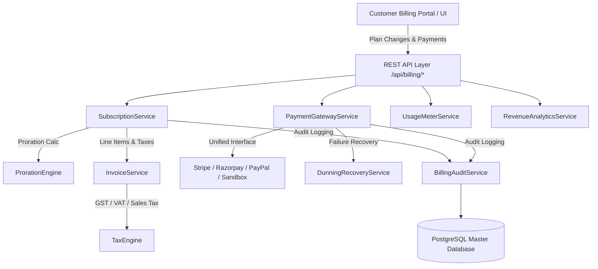

# Enterprise Billing, Subscription Management & Revenue Platform Specification

## Architecture & System Design Overview

This document specifies the enterprise billing architecture for FinTrack Pro SaaS Platform. The billing ecosystem enables multi-tenant subscription lifecycle management, multi-gateway payment processing, configurable tax calculation, real-time usage metering, proration mathematics, dunning failure recovery, customer self-service billing, and executive revenue analytics.



---

## 1. Subscription Plan Architecture

Plans are configuration-driven entities defined in the `SubscriptionPlan` model. Commercial plans include:

- **Free Trial**: 14-day trial, 25k AI tokens, 1,000 API requests, 10 OCR scans, 2 users.
- **Starter**: $49/mo, 250k AI tokens, 25k API requests, 100 OCR scans, 10 users.
- **Professional**: $199/mo, 1M AI tokens, 100k API requests, 500 OCR scans, 50 users.
- **Business**: $499/mo, 5M AI tokens, 500k API requests, 2,500 OCR scans, 250 users.
- **Enterprise**: $1,499/mo, 25M AI tokens, 2.5M API requests, 10,000 OCR scans, 1,000 users.

---

## 2. Subscription Lifecycle Engine

State transitions follow a strict finite-state machine:

```
[TRIALING] ---> [ACTIVE] ---> [PAST_DUE] ---> [UNPAID] ---> [CANCELED]
    |               ^              |               |
    +--------------->--------------+---------------+ (Reactivation)
```

1. **Trial Activation**: Organization onboarding sets status `TRIALING` with 14-day duration.
2. **Upgrade / Downgrade**: Triggered via `SubscriptionService.changePlan()`. Calculates financial proration, generates invoice line-items, applies credits, updates entitlements immediately.
3. **Renewal**: Automated billing cycle execution at `currentPeriodEnd`.
4. **Cancellation**: Voluntary user cancellation (`cancelAtPeriodEnd = true`) or immediate termination.

---

## 3. Payment Gateway Abstraction & Idempotency

`PaymentGatewayService` provides a unified payment processing interface:
- Supports **Stripe**, **Razorpay**, **PayPal**, and **Offline Mock/Sandbox**.
- **Idempotency**: All requests require a unique `idempotencyKey` stored in `PaymentTransaction`. Duplicate requests yield cached responses without duplicate charges.
- **Webhooks**: `/api/billing/webhooks/[gateway]` receives async notifications and updates transaction states idempotently.

---

## 4. Financial Proration Mathematics

When plan upgrades/downgrades occur mid-billing period, `ProrationEngine` calculates exact credits and charges:

$$\text{Fraction Remaining} = \frac{\text{Period End Date} - \text{Effective Date}}{\text{Period End Date} - \text{Period Start Date}}$$

$$\text{Unused Credit} = \text{Current Plan Price} \times \text{Fraction Remaining}$$

$$\text{New Plan Charge} = \text{New Plan Price} \times \text{Fraction Remaining}$$

$$\text{Gross Amount Due} = \text{New Plan Charge} - \text{Unused Credit}$$

$$\text{Net Payable} = \text{Gross Amount Due} + \text{Applicable Tax}$$

---

## 5. Multi-Jurisdictional Tax Framework

`TaxEngine` determines taxation dynamically based on tenant jurisdiction:
- **India**: GST 18% (CGST 9% + SGST 9% or IGST 18%).
- **United Kingdom / EU**: VAT 20% / 19% with B2B Reverse-Charge exemption rules.
- **United States**: State Sales Tax (CA 7.25%, NY 8.875%).
- **Exemptions**: Supports tax exemption certificates and exemption codes.

---

## 6. Real-Time Usage Metering & Quotas

`UsageMeterService` tracks consumption across 7 core metrics:
1. `AI_TOKENS`
2. `API_REQUESTS`
3. `STORAGE_MB`
4. `OCR_DOCUMENTS`
5. `FORECAST_RUNS`
6. `REPORT_GENERATIONS`
7. `ACTIVE_USERS`

Events are aggregated per tenant billing cycle and evaluated against plan quota limits.

---

## 7. Smart Dunning & Payment Recovery

`DunningRecoveryService` executes a smart retry schedule when renewal payments fail:
- **Attempt 1 (Day 1)**: Initial failure, status set to `PAST_DUE`, multi-channel notification sent.
- **Attempt 2 (Day 3)**: Second automated retry attempt.
- **Attempt 3 (Day 7)**: Final grace period attempt.
- **Max Exceeded**: Status set to `UNPAID` / `SUSPENDED`.
- **Restoration**: Successful collection automatically restores status to `ACTIVE` and notifies users.

---

## 8. Executive Revenue Analytics

`RevenueAnalyticsService` aggregates:
- **MRR (Monthly Recurring Revenue)**
- **ARR (Annual Recurring Revenue)**
- **LTV (Customer Lifetime Value)**
- **Churn Rate**
- **ARPU (Average Revenue Per User)**
- **Payment Success Rate**
- **Revenue Distribution by Plan & Monthly Trends**

---

## 9. Immutable Auditability

`BillingAuditService` logs every commercial action in `AuditLog` with actor ID, organization ID, action type, before-and-after JSON snapshots, and IP addresses.
