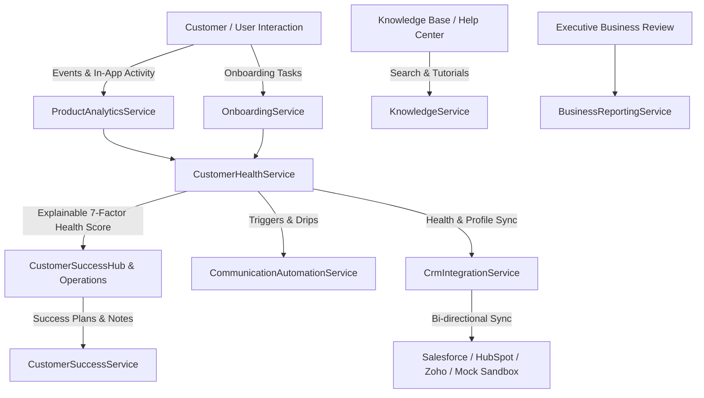

# Enterprise Customer Experience, Product Analytics & Business Operations Specification

## Architecture & System Overview

This document specifies the enterprise customer experience and operational intelligence platform for FinTrack Pro SaaS Platform. The ecosystem provides continuous onboarding guidance, product analytics, explainable customer health scoring, customer success operations, executive business intelligence dashboards, communication automation, CRM synchronization, and knowledge management.

---

## 1. Customer Experience & Onboarding Framework

`OnboardingService` manages a 6-step guided onboarding checklist:
1. `ORG_PROFILE`: Organization Profile & Tax Configuration
2. `FIRST_RECORD`: First Financial Turnover Record or CSV Ingestion
3. `INVITE_TEAM`: Team Member Invitation & RBAC Assignment
4. `AI_FORECAST`: Execution of Time-Series AI Forecasting Model
5. `BILLING_SETUP`: Subscription Plan Selection & Payment Method Setup
6. `REPORTS_EXPORT`: Generation of Executive PPT / PowerBI Summary Report

Completion is evaluated dynamically and rendered in the `/customer-ops` onboarding widget.

---

## 2. Product Analytics & Event Tracking Engine

`ProductAnalyticsService` provides real-time event tracking:
- **DAU & MAU Tracking**: Tracks daily and monthly active users and stickiness ratio ($DAU / MAU \times 100$).
- **Top Feature Adoption**: Measures consumption of Turnover Ingestion, AI Forecast Engine, OCR Receipt Scanning, Reports Studio, and Billing Portal.
- **7-Day AI Utilization Trend**: Time-series visualization of AI token consumption, OCR document scans, and forecast runs.

---

## 3. Explainable Customer Health Scoring Model

`CustomerHealthService` calculates a 0-100 health index based on 7 weighted indicators:

| Health Indicator | Weight | Benchmark / Scoring Criteria |
| :--- | :---: | :--- |
| **Onboarding Completion** | 20% | Percentage of completed onboarding tasks |
| **Login Frequency** | 20% | Active user logins per week (target $\ge 5$ days) |
| **AI Token Utilization** | 20% | Percentage of plan AI token quota utilized |
| **Billing Standing** | 15% | `GOOD_STANDING` (15 pts) vs `PAST_DUE` (0 pts) |
| **Support SLA Tickets** | 10% | Zero open critical support tickets |
| **Report Exports** | 15% | Monthly report generations ($\ge 10$ reports = max) |

**Categories**:
- **EXCELLENT**: Score $\ge 90$
- **HEALTHY**: Score $70 - 89$
- **AT_RISK**: Score $50 - 69$
- **CRITICAL**: Score $< 50$

---

## 4. Customer Success Operations (CS Hub)

`CustomerSuccessService` enables CS teams to:
- Monitor health score distributions across organizations.
- Create and manage strategic success plans (`CustomerSuccessPlan`).
- Record interaction logs and notes.
- Evaluate renewal readiness and trigger proactive interventions.

---

## 5. Communication Automation Engine

`CommunicationAutomationService` handles automated messaging:
- **Onboarding Drips**: Welcome emails and setup reminders.
- **Feature Adoption Tips**: In-app contextual guidance (e.g. OCR invoice scanning tips).
- **Renewal Notices**: Automated 30-day renewal readiness reminders.
- **Delivery Stats**: Sent count, open count, and open rate tracking.

---

## 6. Bi-Directional CRM Integration Layer

`CrmIntegrationService` synchronizes data with enterprise CRM platforms:
- **Supported Providers**: Salesforce, HubSpot, Zoho, and Mock Sandbox Adapter.
- **Synced Entities**: Organization profile, primary contacts, active plan, MRR, health score, and renewal risk.
- **Idempotency & Audit**: Every sync logs an entry in `CrmSyncLog` and `AuditLog`.

---

## 7. Knowledge Management & Help Center

`KnowledgeService` provides:
- Searchable documentation and tutorials across 5 categories: `GETTING_STARTED`, `FINANCIAL_AI`, `BILLING_SUBSCRIPTIONS`, `API_INTEGRATIONS`, `FAQS`.
- Analytics tracking for article view count and user helpfulness voting.

---

## 8. Executive Business Review (EBR) Reporting

`BusinessReportingService` generates executive summary reports capturing:
- Organization health index and category.
- Monthly and annual recurring revenue (MRR/ARR).
- Ingested financial records and AI forecasts executed.
- SLA compliance percentages and quarterly milestones.
