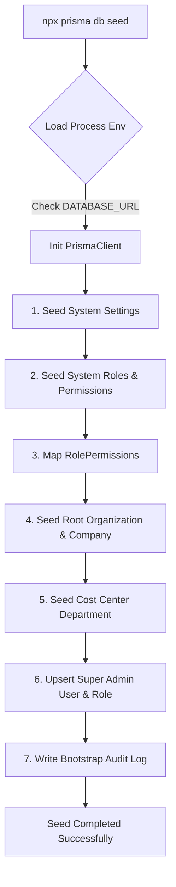

# Enterprise Database Seed Architecture Specification

**System Name:** FinTrack Pro  
**Document Type:** Foundational Seeding Engine Specification  
**Classification:** Enterprise Internal Architecture Standard  
**Version:** 2.0.0  

---

## 1. Executive Summary

The **FinTrack Pro** seeding engine populates critical system metadata, RBAC permissions, lookup tables, and initial enterprise administrative accounts. Seeding is implemented in `prisma/seed.ts` and executed via `npx prisma db seed` or `npm run db:seed`.

---

## 2. Core Architectural Principles

1. **Strict Idempotency:** Every seed query uses `prisma.<model>.upsert()` routines. Executing `npm run db:seed` $N$ consecutive times produces identical state without duplicate key errors.
2. **Environment Isolation:** Development seeds create realistic multi-tenant mock organizations, while Production seeds insert only immutable master metadata (Roles, Permissions, Currencies, Countries, System Settings).
3. **Data Classification:**
   - **System Master Data:** Roles, Permissions, System Settings, ISO Currencies.
   - **Default Tenant Data:** Root Organization, Company, Cost Center Department, Super Admin User.

---

## 3. Seed Execution Topology

