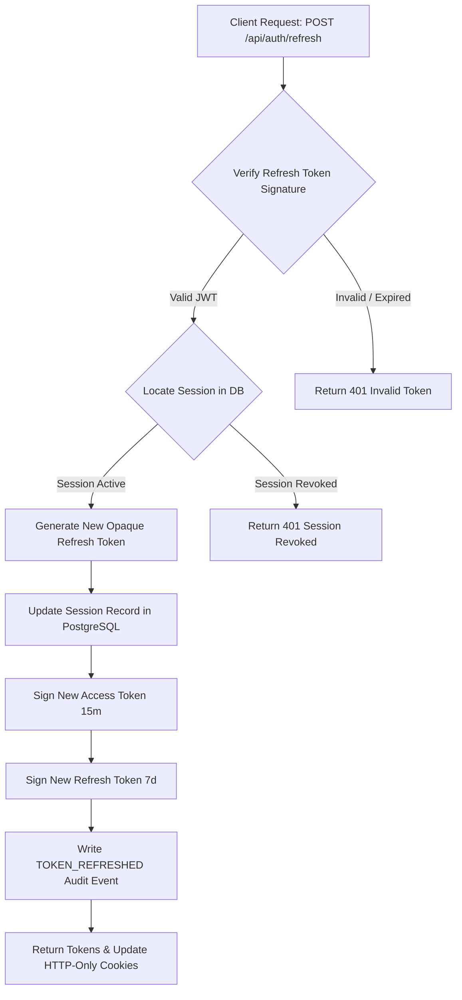

# Enterprise Token Rotation & Revocation Protocol

**System Name:** FinTrack Pro  
**Document Type:** Cryptographic Token Security & Lifecycle Specification  
**Classification:** Enterprise Internal Security Standard  
**Version:** 3.0.0  

---

## 1. Executive Summary

This specification defines the cryptographic token lifecycle, dual-token rotation workflow, token revocation vectors, and threat mitigation models for **FinTrack Pro**.

---

## 2. Dual-Token Architecture

---

## 3. Revocation Vectors

1. **Explicit User Logout (`POST /api/auth/logout`):** Destroys active DB session and clears browser cookies.
2. **Password Change Revocation:** Updating user password triggers `revokeAllUserSessions(userId)` to invalidate active sessions across all devices.
3. **Single Device Termination (`DELETE /api/auth/sessions/:id`):** Deletes specific session from database.
