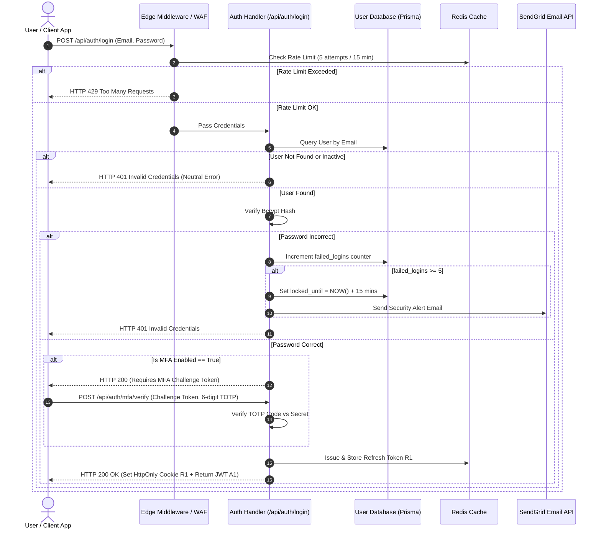
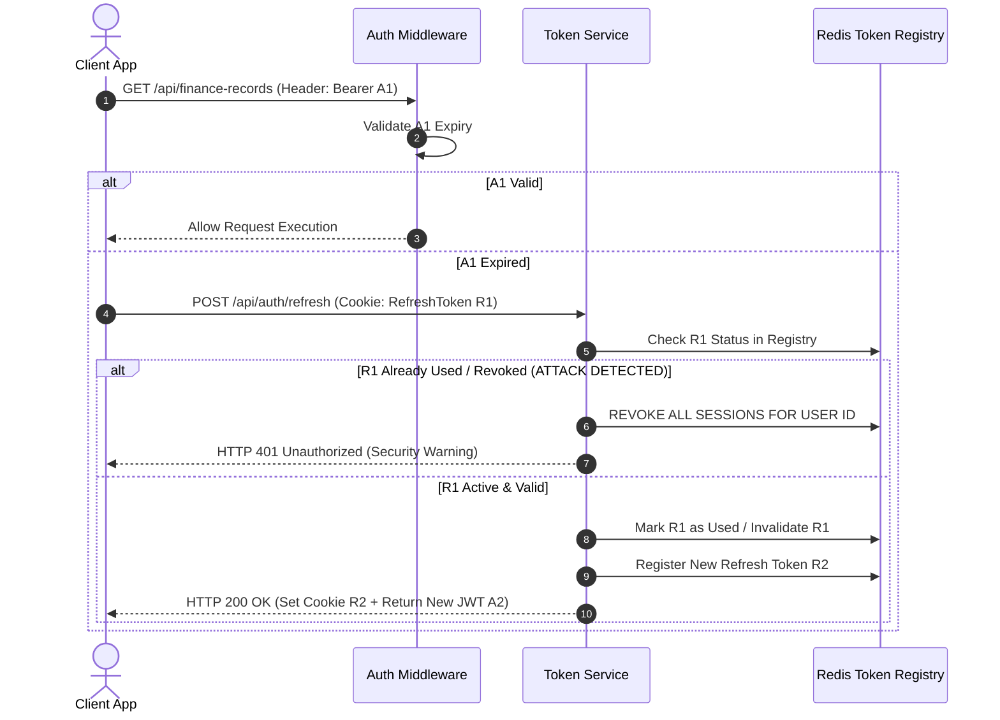

# Detailed Authentication Workflows & Sequence Diagrams

**System Name:** FinTrack Pro Enterprise AI Finance Management Platform  
**Document Type:** Technical Sequence Diagrams & Authentication Flow Specifications  
**Author:** Lead Security Architect & Identity Engineer  
**Status:** Approved for Implementation  

---

## 1. Login & MFA Challenge Sequence Diagram (Mermaid)

---

## 2. Refresh Token Rotation & Attack Prevention Flow

---

## 3. Password Reset & Recovery Workflow
1. User requests password reset via `POST /api/auth/reset-password`.
2. System queries user by email (always returns neutral response to prevent account enumeration).
3. If user exists, generates a 256-bit cryptographically secure random token expiring in 15 minutes.
4. Email dispatched containing reset URL: `https://app.fintrackpro.com/reset-password?token=...`.
5. User submits new password $\rightarrow$ Validated against strength rules $\rightarrow$ Passwords re-hashed $\rightarrow$ **All existing active sessions invalidated**.
