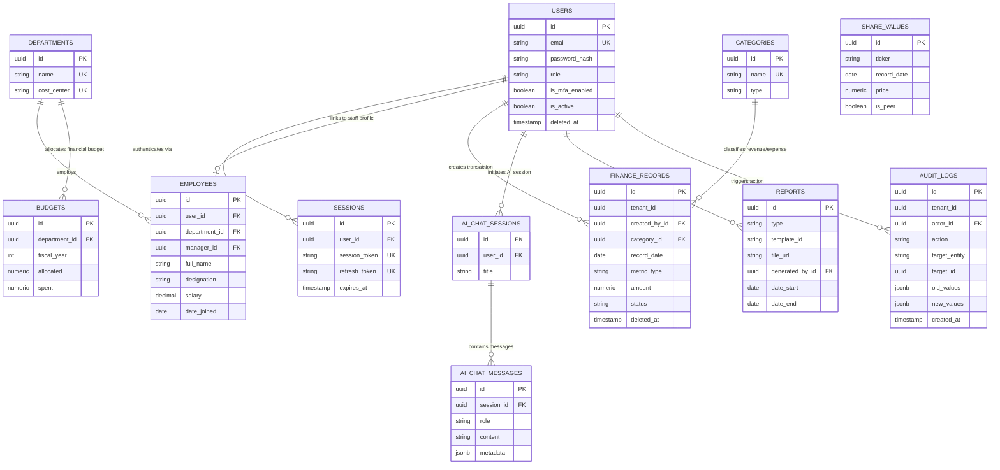

# Entity Relationship Diagram & Data Topology Specification

**System Name:** FinTrack Pro Enterprise AI Finance Management Platform  
**Document Type:** Technical Entity Relationship Diagrams & Structural Topology  
**Author:** Principal Data Engineer & Database Architect  
**Status:** Approved for Implementation  

---

## 1. High-Level Entity Relationship Diagram (Mermaid)

---

## 2. Cardinality & Relationship Breakdown

### 2.1 One-to-One (1:1) Relationships
- **`User` $\leftrightarrow$ `Employee` (Optional 1:1):**
  - An `Employee` profile optionally links to a single `User` account via `userId` foreign key.
  - *Business Rationale:* Directors or advisory staff listed in the employee directory may not require system login credentials.

### 2.2 One-to-Many (1:N) Relationships
- **`User` $\rightarrow$ `FinanceRecord` (1:N):**
  - One user can create many financial records over time.
- **`Department` $\rightarrow$ `Employee` (1:N):**
  - One department contains multiple employees.
- **`AiChatSession` $\rightarrow$ `AiChatMessage` (1:N):**
  - One chat session contains an ordered sequence of user prompt and assistant response messages.

### 2.3 Self-Referential (Hierarchy) Relationships
- **`Employee` $\rightarrow$ `Employee` (Self-Referential Manager 1:N):**
  - `Employee.managerId` points back to `Employee.id`.
  - *Business Rationale:* Represents the organizational reporting structure within the finance department.

---

## 3. Referential Integrity Rules & Deletion Cascades

| Foreign Key | Parent Table | Child Table | On Delete Action | On Update Action | Rationale |
| :--- | :--- | :--- | :--- | :--- | :--- |
| `userId` | `User` | `Session` | `CASCADE` | `CASCADE` | Deleting a user invalidates all active session tokens immediately. |
| `userId` | `User` | `Employee` | `SET NULL` | `CASCADE` | Deleting a user account retains the employee profile record for HR audit. |
| `createdById` | `User` | `FinanceRecord`| `RESTRICT` | `CASCADE` | Prevents deleting a user account if active financial entries reference them. |
| `sessionId` | `AiChatSession` | `AiChatMessage`| `CASCADE` | `CASCADE` | Deleting a chat thread deletes all contained prompt/reply history messages. |
| `actorId` | `User` | `AuditLog` | `SET NULL` | `CASCADE` | Audit log rows are permanent; deleting a user replaces `actor_id` with `NULL`. |
