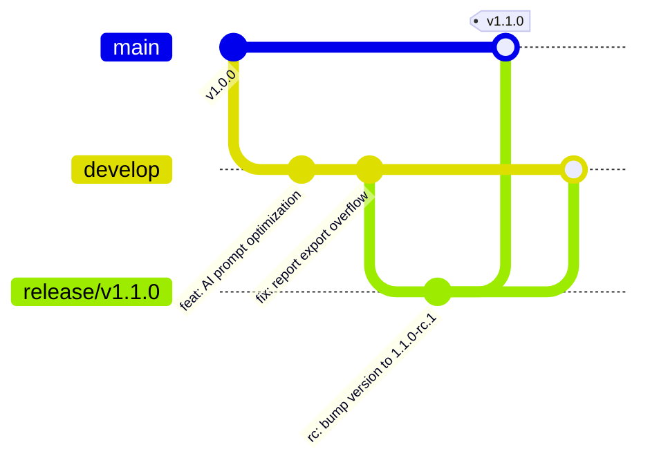

# Release Engineering Guide — FinTrack Pro

## 1. Executive Summary
Release Engineering governs version tagging, release candidate (RC) creation, automated CI/CD packaging, artifact verification, and release notes generation. All releases follow Semantic Versioning (`vMAJOR.MINOR.PATCH`).

---

## 2. Semantic Versioning Specification (`vX.Y.Z`)

- **MAJOR (`X`)**: Incompatible API schema changes, database migrations breaking backward compatibility, or core architectural overhauls.
- **MINOR (`Y`)**: Backward-compatible feature releases, new API endpoints, or enhancement updates.
- **PATCH (`Z`)**: Backward-compatible bug fixes, security hotfixes, or performance tuning.

---

## 3. Git Branching Strategy & Workflow



1. `main`: Production-ready code. Every merge to `main` creates an immutable release tag.
2. `develop`: Integration branch for active feature completion.
3. `feature/*`: Short-lived feature development branches off `develop`.
4. `release/vX.Y.Z`: Staging candidate branch for regression testing and deployment verification.
5. `hotfix/*`: Emergency patch branches off `main` merged directly to `main` and `develop`.

---

## 4. Release Candidate & Artifact Build Process

```bash
# 1. Checkout integration branch & verify clean state
git checkout develop
git pull origin develop

# 2. Cut release candidate branch
git checkout -b release/v1.1.0

# 3. Execute automated build and config checks
npm run config:check
npm run db:platform-check
npm run build

# 4. Create annotated Git release tag
git tag -a v1.1.0 -m "Release v1.1.0: Added PowerBI export and enhanced AI completions"
git push origin release/v1.1.0 --tags
```

---

## 5. Rollback Procedures & Automation

- **Automated Container Rollback**: In Kubernetes / AWS ECS, if container health check probes fail 3 consecutive times during rolling deployment, ingress traffic automatically reverts to the previous image tag (`v1.0.9`).
- **Manual Hotfix Rollback**:
  ```bash
  # Instantly redeploy previous production release tag
  docker pull fintrackpro/app:v1.0.9
  docker-compose up -d
  ```

---
